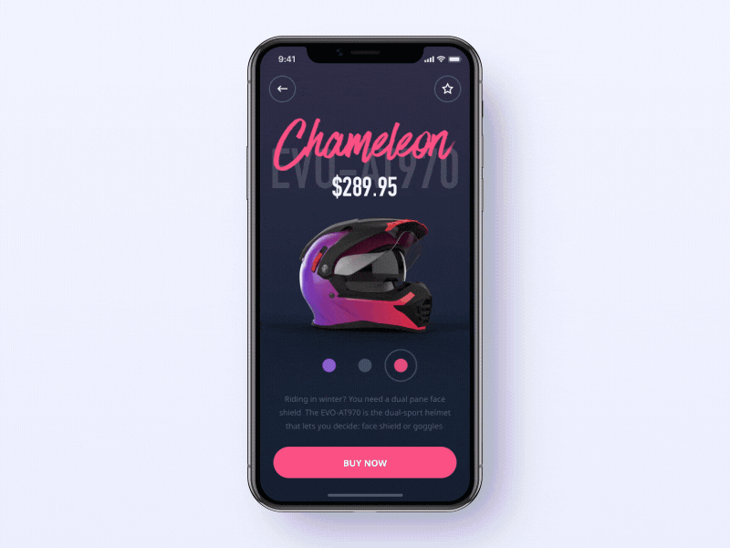
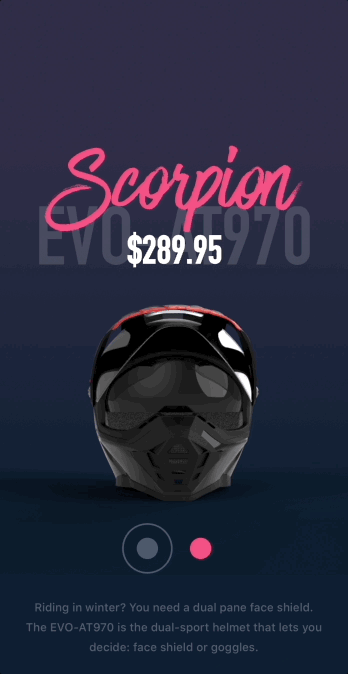

<br><br>
# Helmet


Helmet is a Swift component featuring a 3D model that can be freely rotated with a swipe or drag. 

- [Requirements](#requirements)
- [Installation](#installation)
- [License](#license)

Helmet is designed to showcase an object. The 3D model can be rotated 360° by swiping or dragging, which allows the user to see every detail. There is an easy-to-spot product’s name and price. Helmet also offers color selection, so it’s a ready-made solution for an online store app.



Here is the Helmet showcase:



## Requirements

- iOS 11.0+
- Xcode 11.0+
- Swift 5.0+

## Installation

### CocoaPods

To integrate Helmet into your Xcode project with CocoaPods, specify it in your `Podfile`:

```ruby
pod 'Helmet', :git => 'https://github.com/shakurocom/HelmetDemo.git', :commit => 281ad9089d463e2c003d4b6076394a8bca63826d
```

Then, run the following command:

```bash
$ pod install
```

### Manually

If you prefer not to use CocoaPods, you can integrate Shakuro.Helmet simply by copying it to your project.

## License

Shakuro.Helmet is released under the MIT license. See LICENSE for details. [See LICENSE](https://github.com/shakurocom/ScrollableTabs/blob/master/LICENSE.md) for details.

## Give it a try and reach us

Star this tool if you like it, it will help us grow and add new useful things. 
Feel free to reach out and hire our team to develop a mobile or web project for you.


